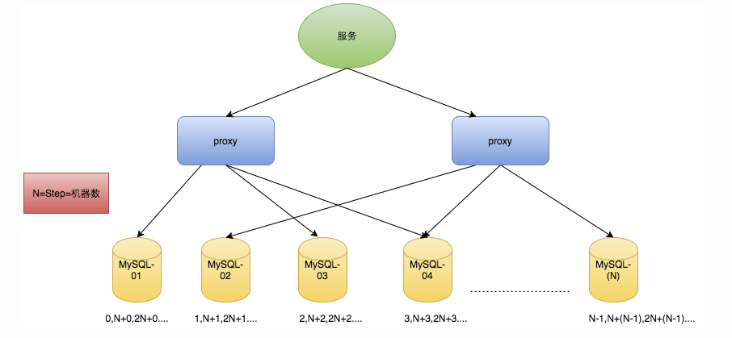
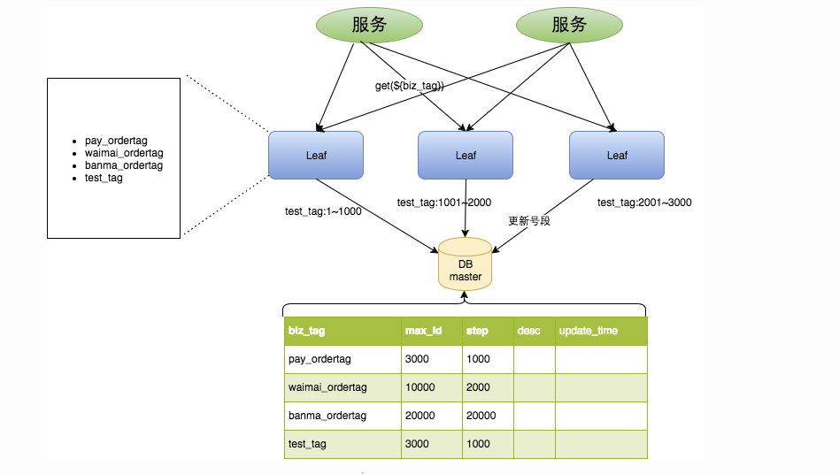
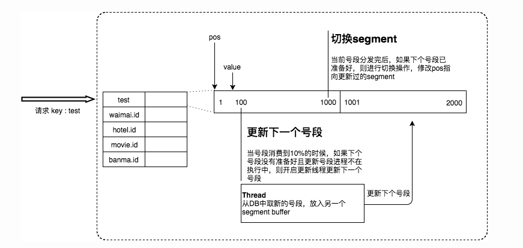
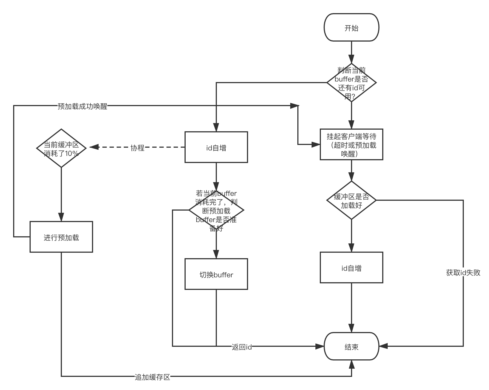

## Leaf-Segment

> 简介：今天直接开门见山，先来介绍一下我今天所带来的东西。没错，看标题想必大家已经想到了 —— Leaf-segment数据库获取`ID`方案。这个方案已经喜闻乐见了，美团早就进行了开源，不过他是由`java`来实现的，所以最近为了学习这一方面知识，我用`go`自己实现了一下，目前自己验证是没有发现什么`bug`，等待大家的检验，发现`bug`可及时反馈（提mr或加我vx都可）。
>
> 代码已收录到我的个人仓库——[go-算法系列(go-algorithm)](https://github.com/asong2020/go-algorithm。
>
> 欢迎`Star`，感谢各位～～～。
>
> 注：下文`leaf-segment`数据库方案设计直接参考美团(摘取部分)。详细请参阅：https://tech.meituan.com/2017/04/21/mt-leaf.html


## 快速使用

### 创建数据库

```go
CREATE TABLE `leaf_alloc` (
  `id` int(11) NOT NULL AUTO_INCREMENT,
  `biz_tag` varchar(128)  NOT NULL DEFAULT '',
  `max_id` bigint(20) NOT NULL DEFAULT '1',
  `step` int(11) NOT NULL,
  `description` varchar(256)  DEFAULT NULL,
  `update_time` bigint(20) NOT NULL DEFAULT '0',
  PRIMARY KEY (`id`),
  UNIQUE KEY (`biz_tag`)
) ENGINE=InnoDB;
```

也可以直接使用我已经生成好的`SQL`文件(已在工程项目中)。各个字段的介绍我会在后文代码实现部分进行解析，这里就不一一解析了。

### 获取并运行项目

```shell
// 1 新建文件目录
$ mdkir asong.cloud
$ cd asong.cloud
// 2 获取项目
$ git clone git@github.com:asong2020/go-algorithm.git
// 3 进入项目目录
$ cd go-go-algorithm/leaf
// 4 运行
$ go run main.go //运行
```


### 测试

#### 创建业务号段

```go
URI: POST http://localhost:8080/api/leaf
Param(json):
{
    "biz_tag": "test_create_one",
    "max_id":  1, // 可以不传 默认为1
    "step": 2000, // 可以不传 默认为200
    "descprition": "test api one"
}
```

- 示例：

```go
curl --location --request POST 'http://localhost:8080/api/leaf' \
--header 'Content-Type: application/json' \
--data-raw '{
    "biz_tag": "test_create_one",
    "descprition": "test api one"
}'
```

#### 初始化DB中的号段到内存中

```go
URI: PUT http://localhost:8080/api/leaf/init/cache
Param(json):
{
    "biz_tag": "test_create"
}
```

- 示例

```go
curl --location --request PUT 'http://localhost:8080/api/leaf/init/cache' \
--header 'Content-Type: application/json' \
--data-raw '{
    "biz_tag": "test_create"
}'
```

#### 获取ID

```go
URI: GET http://localhost:8080/api/leaf
Param: 
?biz_tag=test_create
```

- 示例

```go
curl --location --request GET 'http://localhost:8080/api/leaf?biz_tag=test_create'
```

#### 更新`step`

```go
URI: PUT http://localhost:8080/api/leaf/step
Param(json):
{
    "step":   10000,
    "biz_tag": "test_create"
}
```

- 示例

```go
curl --location --request PUT 'http://localhost:8080/api/leaf/step' \
--header 'Content-Type: application/json' \
--data-raw '{
    "step": 10000,
    "biz_tag": "test_create"
}'
```


## Leaf-Segment方案实现

### 背景

在复杂分布式系统中，往往需要对大量的数据和消息进行唯一标识。一个能够生成全局唯一ID的系统是非常必要的。比如某宝，业务分布广泛，这么多业务对数据分库分表后需要有一个唯一ID来标识一条数据或消息，数据库的自增ID显然不能满足需求；所以，我们可以总结一下业务系统对ID号的要求有哪些呢？

1. 全局唯一性：不能出现重复的ID号，既然是唯一标识，这是最基本的要求。
2. 趋势递增：在MySQL InnoDB引擎中使用的是聚集索引，由于多数RDBMS使用B-tree的数据结构来存储索引数据，在主键的选择上面我们应该尽量使用有序的主键保证写入性能。
3. 单调递增：保证下一个ID一定大于上一个ID，例如事务版本号、IM增量消息、排序等特殊需求。
4. 信息安全：如果ID是连续的，恶意用户的扒取工作就非常容易做了，直接按照顺序下载指定URL即可；如果是订单号就更危险了，竞对可以直接知道我们一天的单量。所以在一些应用场景下，会需要ID无规则、不规则。

上述123对应三类不同的场景，3和4需求还是互斥的，无法使用同一个方案满足。

本文只讲述场景3的方案，即`leaf-segment`。场景4可以用`雪花算法`实现，这个我之前实现过了，有兴趣的童鞋可以参考一下。传送门：https://github.com/asong2020/go-algorithm/tree/master/snowFlake

### 数据库生成

`leaf-sement`是在使用数据库生成方案上做的改进。这里先抛砖引玉一下，看一下数据库生成方案是怎样实现的。

以MySQL举例，利用给字段设置`auto_increment_increment`和`auto_increment_offset`来保证ID自增，每次业务使用下列SQL读写MySQL得到ID号。

```sql
begin;
REPLACE INTO Tickets64 (stub) VALUES ('a');
SELECT LAST_INSERT_ID();
commit;
```

这种方案的优缺点如下：

优点：

- 非常简单，利用现有数据库系统的功能实现，成本小，有DBA专业维护。
- ID号单调自增，可以实现一些对ID有特殊要求的业务。

缺点：

- 强依赖DB，当DB异常时整个系统不可用，属于致命问题。配置主从复制可以尽可能的增加可用性，但是数据一致性在特殊情况下难以保证。主从切换时的不一致可能会导致重复发号。
- ID发号性能瓶颈限制在单台MySQL的读写性能。

对于MySQL性能问题，可用如下方案解决：在分布式系统中我们可以多部署几台机器，每台机器设置不同的初始值，且步长和机器数相等。比如有两台机器。设置步长step为2，TicketServer1的初始值为1（1，3，5，7，9，11…）、TicketServer2的初始值为2（2，4，6，8，10…）。这是Flickr团队在2010年撰文介绍的一种主键生成策略（[Ticket Servers: Distributed Unique Primary Keys on the Cheap ](http://code.flickr.net/2010/02/08/ticket-servers-distributed-unique-primary-keys-on-the-cheap/)）。如下所示，为了实现上述方案分别设置两台机器对应的参数，TicketServer1从1开始发号，TicketServer2从2开始发号，两台机器每次发号之后都递增2。

```sql
TicketServer1:
auto-increment-increment = 2
auto-increment-offset = 1

TicketServer2:
auto-increment-increment = 2
auto-increment-offset = 2
```

假设我们要部署N台机器，步长需设置为N，每台的初始值依次为0,1,2…N-1那么整个架构就变成了如下图所示：



image


这种架构貌似能够满足性能的需求，但有以下几个缺点：

- 系统水平扩展比较困难，比如定义好了步长和机器台数之后，如果要添加机器该怎么做？假设现在只有一台机器发号是1,2,3,4,5（步长是1），这个时候需要扩容机器一台。可以这样做：把第二台机器的初始值设置得比第一台超过很多，比如14（假设在扩容时间之内第一台不可能发到14），同时设置步长为2，那么这台机器下发的号码都是14以后的偶数。然后摘掉第一台，把ID值保留为奇数，比如7，然后修改第一台的步长为2。让它符合我们定义的号段标准，对于这个例子来说就是让第一台以后只能产生奇数。扩容方案看起来复杂吗？貌似还好，现在想象一下如果我们线上有100台机器，这个时候要扩容该怎么做？简直是噩梦。所以系统水平扩展方案复杂难以实现。
- ID没有了单调递增的特性，只能趋势递增，这个缺点对于一般业务需求不是很重要，可以容忍。
- 数据库压力还是很大，每次获取ID都得读写一次数据库，只能靠堆机器来提高性能

### `Leaf-Segment`数据库方案

`Leaf-Segment`数据库方案是在上面的数据库生成方案上做的改进。

做了如下改变： - 原方案每次获取ID都得读写一次数据库，造成数据库压力大。改为利用proxy server批量获取，每次获取一个segment(step决定大小)号段的值。用完之后再去数据库获取新的号段，可以大大的减轻数据库的压力。 - 各个业务不同的发号需求用biz_tag字段来区分，每个biz-tag的ID获取相互隔离，互不影响。如果以后有性能需求需要对数据库扩容，不需要上述描述的复杂的扩容操作，只需要对biz_tag分库分表就行。

数据库表设计如下：

```go
CREATE TABLE `leaf_alloc` (
  `id` int(11) NOT NULL AUTO_INCREMENT,
  `biz_tag` varchar(128)  NOT NULL DEFAULT '',
  `max_id` bigint(20) NOT NULL DEFAULT '1',
  `step` int(11) NOT NULL,
  `description` varchar(256)  DEFAULT NULL,
  `update_time` bigint(20) NOT NULL DEFAULT '0',
  PRIMARY KEY (`id`),
  UNIQUE KEY (`biz_tag`)
) ENGINE=InnoDB;
```

这里我依旧使用了一个自增主键，不过没什么用，可以忽略。biz_tag用来区分业务(所以我把它设置成了唯一索引)，max_id表示该biz_tag目前所被分配的ID号段的最大值，step表示每次分配的号段长度。原来获取ID每次都需要写数据库，现在只需要把step设置得足够大，比如1000。那么只有当1000个号被消耗完了之后才会去重新读写一次数据库。读写数据库的频率从1减小到了1/step，大致架构如下图所示：



test_tag在第一台Leaf机器上是1~1000的号段，当这个号段用完时，会去加载另一个长度为step=1000的号段，假设另外两台号段都没有更新，这个时候第一台机器新加载的号段就应该是3001~4000。同时数据库对应的biz_tag这条数据的max_id会从3000被更新成4000，更新号段的SQL语句如下：

```sql
Begin
UPDATE table SET max_id=max_id+step WHERE biz_tag=xxx
SELECT tag, max_id, step FROM table WHERE biz_tag=xxx
Commit
```

这种模式有以下优缺点：

优点：

- Leaf服务可以很方便的线性扩展，性能完全能够支撑大多数业务场景。
- ID号码是趋势递增的8byte的64位数字，满足上述数据库存储的主键要求。
- 容灾性高：Leaf服务内部有号段缓存，即使DB宕机，短时间内Leaf仍能正常对外提供服务。
- 可以自定义max_id的大小，非常方便业务从原有的ID方式上迁移过来。

缺点：

- ID号码不够随机，能够泄露发号数量的信息，不太安全。
- TP999数据波动大，当号段使用完之后还是会hang在更新数据库的I/O上，tg999数据会出现偶尔的尖刺。
- DB宕机会造成整个系统不可用。


#### 双buffer优化

对于第二个缺点，Leaf-segment做了一些优化，简单的说就是：

Leaf 取号段的时机是在号段消耗完的时候进行的，也就意味着号段临界点的ID下发时间取决于下一次从DB取回号段的时间，并且在这期间进来的请求也会因为DB号段没有取回来，导致线程阻塞。如果请求DB的网络和DB的性能稳定，这种情况对系统的影响是不大的，但是假如取DB的时候网络发生抖动，或者DB发生慢查询就会导致整个系统的响应时间变慢。

为此，我们希望DB取号段的过程能够做到无阻塞，不需要在DB取号段的时候阻塞请求线程，即当号段消费到某个点时就异步的把下一个号段加载到内存中。而不需要等到号段用尽的时候才去更新号段。这样做就可以很大程度上的降低系统的TP999指标。详细实现如下图所示：



采用双buffer的方式，Leaf服务内部有两个号段缓存区segment。当前号段已下发10%时，如果下一个号段未更新，则另启一个更新线程去更新下一个号段。当前号段全部下发完后，如果下个号段准备好了则切换到下个号段为当前segment接着下发，循环往复。

- 每个biz-tag都有消费速度监控，通常推荐segment长度设置为服务高峰期发号QPS的600倍（10分钟），这样即使DB宕机，Leaf仍能持续发号10-20分钟不受影响。
- 每次请求来临时都会判断下个号段的状态，从而更新此号段，所以偶尔的网络抖动不会影响下个号段的更新。


## 代码实现

终于到本文的重点了，下面就给大家讲解一下我是怎么实现的。

### 代码架构

这里先贴一下我的代码架构，具体如下：

```lu
leaf
├── common -- common包，放的是一些client初始的代码
├── conf   -- conf包，配置文件
├── config -- config包，读取配置文件代码部分
├── dao    -- dao包，DB操作部分
├── handler -- hanler包，路由注册即API代码实现部分
├── images -- 本文的图片文件
├── model -- model包，db模型或其他模型
├── service -- service包，逻辑实现部分
├── wire    -- wire包，依赖绑定
├── leaf_svr.go -- main运行先置条件
└── main.go -- main函数
```


### 实现分析

在我们实现之前，肯定要分析一波，我们要做什么，怎么做？我老大经常跟我说的一句话："先把需求分析明白了，再动手，返工反而是浪费时间"。

1. 首先我们要把一段号段存从DB中拿到存到内存中，并且可能同时存在很多业务，这里我就想到用`map`来存，使用`biz_tag`来作为`key`，因为它具有唯一性，并且能很快的定位。所以我们可以定义一个这样的结构体作为全局ID分发器：

```go
// 全局分配器
// key: biz_tag value: SegmentBuffer
type LeafSeq struct {
	cache sync.Map
}
```
这里考虑到并发操作，所以使用`sync.map`，因为他是并发安全的。
2. 确定了`ID`怎么存，接下来我们就要思考，我们存什么样的结构比较合适。这里我决定直接实现"双buffer优化"的方案。这里我准备自己定义`struct`，然后用切片来模拟双buffer。所以可以设计如下结构：

```go
// 号段
type LeafSegment struct {
	Cursor uint64 // 当前发放位置
	Max    uint64 // 最大值
	Min    uint64 // 开始值即最小值
	InitOk bool   // 是否初始化成功
}
```

字段说明：首先要有一个字段来记录当前数据发放到什么位置了，`Cursor`就是来做这个的。其次我们还要把范围固定住，也是这个号段的开始和结束，也就是`min`、`max`字段的作用。最后我们还要考虑一个问题，既然我们使用的双`buffer`，也就是说我们并不能确定下一段`buffer`是否可用，所以加了一个`initOK`字段来进行表明。

3. 上面也设计好了号段怎么存，接下来我们设计怎么线程安全的把这些`id`有序的发放出去，所以可以设计如下结构：

```go
type LeafAlloc struct {
	Key        string                 // 也就是`biz_tag`用来区分业务
	Step       int32                  // 记录步长
	CurrentPos int32                  // 当前使用的 segment buffer光标; 总共两个buffer缓存区，循环使用
	Buffer     []*LeafSegment         // 双buffer 一个作为预缓存作用
	UpdateTime time.Time              // 记录更新时间 方便长时间不用进行清理，防止占用内存
	mutex      sync.Mutex             // 互斥锁
	IsPreload  bool                   // 是否正在预加载
	Waiting    map[string][]chan byte // 挂起等待
}
```

字段介绍：`key`也就是我们的`biz_tag`，可以用它快速从`map`中定义数据。`Step`记录当前号段的步长，因为步长是可以动态改变的，所以这里需要记录一下。`currentPos`这个完全是记录当前使用`buffer`，因为是双`buffer`，所以需要定位。`buffer`这个不用介绍大家也应该知道，就是缓存池。`Update_time`这个字段大多人可能想不到为什么会有这个，我们的号段现在都存到内存当中了，那么当我们的业务变多了以后，那么内存就会越占越多，所以我们需要记录他的更新时间，这样我们可以使用一个定时器定期去清除长时间不使用的号段，节省内存。`IsPreload`这个字段是给预加载使用，当前缓冲区的号段使用了90%后，我们就会去预加载下一段缓存池，为了防止多次重复加载，所以使用该字段做标识。`waiting`这里我使用的是`map+chan`的结合，这里的作用就是当我们当前缓存池的号段消耗的比较快或者预加载失败了，就会导致现在没有缓存池可用，所以我们可以去等待一会，因为现在有可能正在做预加载，这样可以保持系统的高可用，如果超时仍未等到预加载成功则返回失败，下一次调用即可。

基本思想就是这样啦，下面我们就分块看一下代码。


###  先从DB层走起

我这个人写代码，爱从`DB`层开始，也就是把我需要的`CRUD`操作都提前写好并测试，这里就不贴每段代码的实现了，要不代码量有点大，并且也没有必要，直接介绍一下有哪些方法就可以了。

```go
func (l *LeafDB) Create(ctx context.Context, leaf *model.Leaf) error {}
func (l *LeafDB) Get(ctx context.Context, bizTag string, tx *sql.Tx) (*model.Leaf, error) {}
func (l *LeafDB) UpdateMaxID(ctx context.Context, bizTag string, tx *sql.Tx) error {}
func (l *LeafDB) UpdateMaxIdByCustomStep(ctx context.Context, step int32, bizTag string, tx *sql.Tx) error {}
func (l *LeafDB) GetAll(ctx context.Context) ([]*model.Leaf, error) {}
func (l *LeafDB) UpdateStep(ctx context.Context, step int32, bizTag string) error {
```

1. 创建`leaf`方法。
2. 获取某个业务的号段
3. 号段用完时是需要更新DB到下一个号段
4. 根据自定义`step`更新DB到下一个号段
5. 获取DB中所有的业务号段
6. 更新DB中`step`


### 实现获取新号段部分的代码

先贴出我的代码：

```go
func (l *LeafDao) NextSegment(ctx context.Context, bizTag string) (*model.Leaf, error) {
	// 开启事务
	tx, err := l.sql.Begin()
	defer func() {
		if err != nil {
			l.rollback(tx)
		}
	}()
	if err = l.checkError(err); err != nil {
		return nil, err
	}
	err = l.db.UpdateMaxID(ctx, bizTag, tx)
	if err = l.checkError(err); err != nil {
		return nil, err
	}
	leaf, err := l.db.Get(ctx, bizTag, tx)
	if err = l.checkError(err); err != nil {
		return nil, err
	}
	// 提交事务
	err = tx.Commit()
	if err = l.checkError(err); err != nil {
		return nil, err
	}
	return leaf, nil
}

func (l *LeafDao) checkError(err error) error {
	if err == nil {
		return nil
	}
	if message, ok := err.(*mysql.MySQLError); ok {
		fmt.Printf("it's sql error; str:%v", message.Message)
	}
	return errors.New("db error")
}

func (l *LeafDao) rollback(tx *sql.Tx) {
	err := tx.Rollback()
	if err != sql.ErrTxDone && err != nil {
		fmt.Println("rollback error")
	}
}
```

实现其实很简单，也就是先更新一下数据库中的号段，然后再取出来就可以了，这里为了保证数据的一致性和防止多次更新DB导致号段丢失，所以使用了事务，没有什么特别的点，看一下代码就能懂了。


### 初始化及获取ID

这里我把DB中的号段初始化到内存这一步和获取`ID`合到一起来说吧，因为在获取ID时会有兜底策略进行初始化。先看初始化部分代码：

```go
// 第一次使用要初始化也就是把DB中的数据存到内存中,非必须操作，直接使用的话有兜底策略
func (l *LeafService) InitCache(ctx context.Context, bizTag string) (*model.LeafAlloc, error) {
	leaf, err := l.dao.NextSegment(ctx, bizTag)
	if err != nil {
		fmt.Printf("initCache failed; err:%v\n", err)
		return nil, err
	}
	alloc := model.NewLeafAlloc(leaf)
	alloc.Buffer = append(alloc.Buffer, model.NewLeafSegment(leaf))

	_ = l.leafSeq.Add(alloc)
	return alloc, nil
}
```

这里步骤主要分两步：

1. 从DB中获取当前业务的号段
2. 保存到内存中，也就是存到`map`

之后是我们来看一下我们是如何获取`id`的，这里步骤比较多了，也是最核心的地方了。

先看主流程：

```go
func (l *LeafService) GetID(ctx context.Context, bizTag string) (uint64, error) {
	// 先去内存中看一下是否已经初始了，未初始化则开启兜底策略初始化一下。
	l.mutex.Lock()
	var err error
	seqs := l.leafSeq.Get(bizTag)
	if seqs == nil {
		// 不存在初始化一下
		seqs, err = l.InitCache(ctx, bizTag)
		if err != nil {
			return 0, err
		}
	}
	l.mutex.Unlock()

	var id uint64
	id, err = l.NextID(seqs)
	if err != nil {
		return 0, err
	}
	l.leafSeq.Update(bizTag, seqs)

	return id, nil
}
```

主要分为三步：

1. 先去内存中查看该业务是否已经初始化了，未初始化则开启兜底策略进行初始化。
2. 获取`id`
3. 更新内存中的数据。

这里最终要的就是第二步，获取`id`，这里我先把代码贴出来，然后细细讲解一下：

```go
func (l *LeafService) NextID(current *model.LeafAlloc) (uint64, error) {
	current.Lock()
	defer current.Unlock()
	var id uint64
	currentBuffer := current.Buffer[current.CurrentPos]
	// 判断当前buffer是否是可用的
	if current.HasSeq() {
		id = atomic.AddUint64(&current.Buffer[current.CurrentPos].Cursor, 1)
		current.UpdateTime = time.Now()
	}

	// 当前号段已下发10%时，如果下一个号段未更新加载，则另启一个更新线程去更新下一个号段
	if currentBuffer.Max-id < uint64(0.9*float32(current.Step)) && len(current.Buffer) <= 1 && !current.IsPreload {
		current.IsPreload = true
		cancel, _ := context.WithTimeout(context.Background(), 3*time.Second)
		go l.PreloadBuffer(cancel, current.Key, current)
	}

	// 第一个buffer的segment使用完成 切换到下一个buffer 并移除现在的buffer
	if id == currentBuffer.Max {
		// 判断第二个buffer是否准备好了(因为上面开启协程去更新下一个号段会出现失败)，准备好了切换  currentPos 永远是0 不管怎么切换
		if len(current.Buffer) > 1 && current.Buffer[current.CurrentPos+1].InitOk {
			current.Buffer = append(current.Buffer[:0], current.Buffer[1:]...)
		}
		// 如果没准备好，直接返回就好了，因为现在已经分配id了, 后面会进行补偿
	}
	// 有id直接返回就可以了
	if current.HasID(id) {
		return id, nil
	}

	// 当前buffer已经没有id可用了，此时补偿线程一定正在运行，我们等待一会
	waitChan := make(chan byte, 1)
	current.Waiting[current.Key] = append(current.Waiting[current.Key], waitChan)
	// 释放锁 等待让其他客户端进行走前面的步骤
	current.Unlock()

	timer := time.NewTimer(500 * time.Millisecond) // 等待500ms最多
	select {
	case <-waitChan:
	case <-timer.C:
	}

	current.Lock()
	// 第二个缓冲区仍未初始化好
	if len(current.Buffer) <= 1 {
		return 0, errors.New("get id failed")
	}
	// 切换buffer
	current.Buffer = append(current.Buffer[:0], current.Buffer[1:]...)
	if current.HasSeq() {
		id = atomic.AddUint64(&current.Buffer[current.CurrentPos].Cursor, 1)
		current.UpdateTime = time.Now()
	}
	return id, nil

}
```

这里我觉得用文字描述不清楚，所以我画了个图，不知道你们能不能看懂，可以对照着代码来看，这样是最清晰的，有问题欢迎留言讨论：




预加载的流程也被我画上去了，预加载的步骤主要有三个：

1. 获取某业务下一个阶段的号段
2. 存储到缓存`buffer`中，留着备用.
3. 唤醒当前正在挂起等待的客户端

代码实现如下：

```go
func (l *LeafService) PreloadBuffer(ctx context.Context, bizTag string, current *model.LeafAlloc) error {
	for i := 0; i < MAXRETRY; i++ {
		leaf, err := l.dao.NextSegment(ctx, bizTag)
		if err != nil {
			fmt.Printf("preloadBuffer failed; bizTag:%s;err:%v", bizTag, err)
			continue
		}
		segment := model.NewLeafSegment(leaf)
		current.Buffer = append(current.Buffer, segment) // 追加
		l.leafSeq.Update(bizTag, current)
		current.Wakeup()
		break
	}
	current.IsPreload = false
	return nil
}
func (l *LeafAlloc) Wakeup() {
	l.mutex.Lock()
	defer l.mutex.Unlock()
	for _, waitChan := range l.Waiting[l.Key] {
		close(waitChan)
	}
	l.Waiting[l.Key] = l.Waiting[l.Key][:0]
}
```


### 缓存清理

到这里，所有核心代码都已经实现了，还差最后一步，就是清缓存，就像上面说到的，超长时间不用的号段我们就要清除它，不能让他堆积造成内存浪费。这里我实现的是清理超过15min未使用的号段。实现也很简单，就是使用`timer`做一个定时器，每隔15min就去遍历存储号段的`map，把超过15min未更新的号段清除掉（虽然会造成号段浪费，但也要这要做）。

```go
// 清理超过15min没用过的内存
func (l *LeafSeq) clear() {
	for {
		now := time.Now()
		// 15分钟后
		mm, _ := time.ParseDuration("15m")
		next := now.Add(mm)
		next = time.Date(next.Year(), next.Month(), next.Day(), next.Hour(), next.Minute(), 0, 0, next.Location())
		t := time.NewTimer(next.Sub(now))
		<-t.C
		fmt.Println("start clear goroutine")
		l.cache.Range(func(key, value interface{}) bool {
			alloc := value.(*LeafAlloc)
			if next.Sub(alloc.UpdateTime) > ExpiredTime {
				fmt.Printf("clear biz_tag: %s cache", key)
				l.cache.Delete(key)
			}
			return true
		})
	}
}
```


## 总结

好啦，到这里就是接近尾声了，上面就是我实现的整个过程，目前自己测试没有什么问题，后期还会在缝缝补补，大家也可以帮我找找问题，欢迎提出你们宝贵的建议～～～。

**代码已收录到我的个人仓库——[go-算法系列(go-algorithm)](https://github.com/asong2020/go-algorithm。**

**欢迎`Star`，感谢各位～～～。**

**好啦，这一篇文章到这就结束了，我们下期见～～。希望对你们有用，又不对的地方欢迎指出，可添加我的golang交流群，我们一起学习交流。**

**结尾给大家发一个小福利吧，最近我在看[微服务架构设计模式]这一本书，讲的很好，自己也收集了一本PDF，有需要的小伙可以到自行下载。获取方式：关注公众号：[Golang梦工厂]，后台回复：[微服务]，即可获取。**

**我翻译了一份GIN中文文档，会定期进行维护，有需要的小伙伴后台回复[gin]即可下载。**

**翻译了一份Machinery中文文档，会定期进行维护，有需要的小伙伴们后台回复[machinery]即可获取。**

**我是asong，一名普普通通的程序猿，让gi我一起慢慢变强吧。我自己建了一个`golang`交流群，有需要的小伙伴加我`vx`,我拉你入群。欢迎各位的关注，我们下期见~~~**


推荐往期文章：

- [machinery-go异步任务队列](https://mp.weixin.qq.com/s/4QG69Qh1q7_i0lJdxKXWyg)
- [十张动图带你搞懂排序算法(附go实现代码)](https://mp.weixin.qq.com/s/rZBsoKuS-ORvV3kML39jKw)
- [Go语言相关书籍推荐（从入门到放弃）](https://mp.weixin.qq.com/s/PaTPwRjG5dFMnOSbOlKcQA)
- [go参数传递类型](https://mp.weixin.qq.com/s/JHbFh2GhoKewlemq7iI59Q)
- [手把手教姐姐写消息队列](https://mp.weixin.qq.com/s/0MykGst1e2pgnXXUjojvhQ)
- [常见面试题之缓存雪崩、缓存穿透、缓存击穿](https://mp.weixin.qq.com/s?__biz=MzIzMDU0MTA3Nw==&mid=2247483988&idx=1&sn=3bd52650907867d65f1c4d5c3cff8f13&chksm=e8b0902edfc71938f7d7a29246d7278ac48e6c104ba27c684e12e840892252b0823de94b94c1&token=1558933779&lang=zh_CN#rd)
- [详解Context包，看这一篇就够了！！！](https://mp.weixin.qq.com/s/JKMHUpwXzLoSzWt_ElptFg)
- [go-ElasticSearch入门看这一篇就够了(一)](https://mp.weixin.qq.com/s/mV2hnfctQuRLRKpPPT9XRw)
- [面试官：go中for-range使用过吗？这几个问题你能解释一下原因吗](https://mp.weixin.qq.com/s/G7z80u83LTgLyfHgzgrd9g)
- [学会wire依赖注入、cron定时任务其实就这么简单！](https://mp.weixin.qq.com/s/qmbCmwZGmqKIZDlNs_a3Vw)
- [听说你还不会jwt和swagger-饭我都不吃了带着实践项目我就来了](https://mp.weixin.qq.com/s/z-PGZE84STccvfkf8ehTgA)
- [掌握这些Go语言特性，你的水平将提高N个档次(二)](https://mp.weixin.qq.com/s/7yyo83SzgQbEB7QWGY7k-w)

