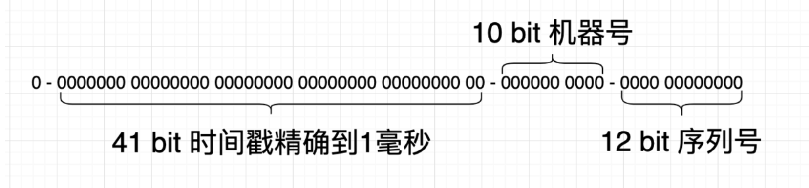
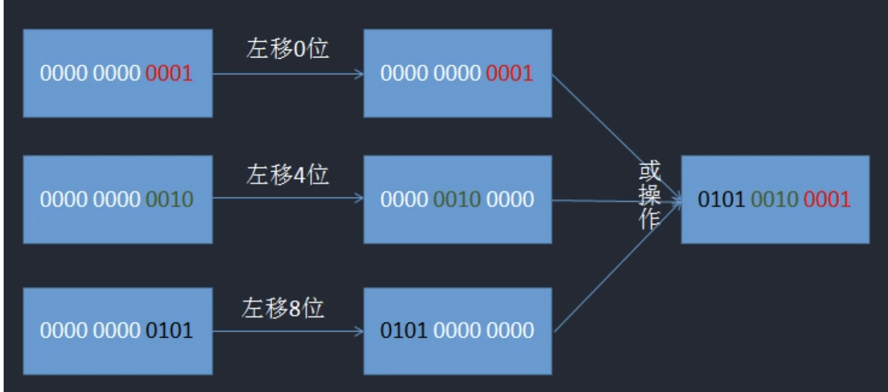

## 雪花算法

`author：asong`   `公众号：Golang梦工厂`

> 简介：唯一ID算法`SnowFlake`是Twitter公司提出来的算法。非常广泛的应用在各种业务系统里。这一篇我们我们学习一下原生的`SnowFlake`算法，
> 并用`go`实现一下。

### 雪花算法背景
雪花算法产生的背景当然是`twitter`高并发环境下对唯一ID生成的需求，得益于`twitter`内部牛逼的技术，雪花算法能够流传于至今并且被广泛使用，是因为它有几个特点

- 能满足高并发分布式系统环境下ID不重复
- 生成效率高
- 基于时间戳，可以保证基本有序递增
- 不依赖于第三方的库或者中间件
- 生成的`id`具有时序性和唯一性


### 雪花算法原理

先来看一个图片吧，来源于网络：：


由图我们可以看出来，`snowFlake ID`结构是一个64bit的`int`型数据。

- 第1位bit

在二进制中最高位为1，表示的是负数，因为我们使用的`id`应该都是整数，所以这里最高位应该是0。

- 41bit时间戳

41位可以表示`2^41-1`个数字，如果只用来表示正整数，可以表示的数值范围是：0 - (2^41 -1)，这里减去1的原因就是因为数值范围是从0开始计算的，而不是从1开始的。

这里的单位是毫秒，所以41位就可以表示`2^41-1`个毫秒值，这样转化成单位年则是` (2^41-1)/(1000 * 60 * 60 * 24 * 365) = 69`

- 10bit-工作机器id

这里是用来记录工作机器的id。`2^10=1024`表示当前规则允许分布式最大节点数为1024个节点。这里包括5位的`workerID`和5位的`dataCenterID`，这里其实可以不区分，但我下面的代码进行了区分。

- 12bit-序列号

用来记录同毫秒内产生的不同id。12bit可以表示的最大正整数是`2^12-1=4095`，即可以用`0,1,2,3,......4094`这`4095`个数字，表示同一机器同一时间戳(毫秒)内产生的4095个ID序号。

原理就是上面这些，没有什么难度吧，下面我们看代码如何实现：


### 缺点及改进

原生的Snowflake算法是完全依赖于时间的，如果有时钟回拨的情况发生，会生成重复的ID，市场上的解决方案也是非常多的：

- 最简单的方案，就是关闭生成唯一ID机器的时间同步。
- 使用阿里云的的时间服务器进行同步，2017年1月1日的闰秒调整，阿里云服务器NTP系统24小时“消化”闰秒，完美解决了问题。
- 如果发现有时钟回拨，时间很短比如5毫秒,就等待，然后再生成。或者就直接报错，交给业务层去处理。
- 可以找2bit位作为时钟回拨位，发现有时钟回拨就将回拨位加1，达到最大位后再从0开始进行循环。


### go实现雪花算法

#### 1. 定义基本常量

先看代码，我们依次介绍：

```go
const (
	workerIDBits =  uint64(5)  // 10bit 工作机器ID中的 5bit workerID
	dataCenterIDBits = uint64(5) // 10 bit 工作机器ID中的 5bit dataCenterID
	sequenceBits = uint64(12)

	maxWorkerID = int64(-1) ^ (int64(-1) << workerIDBits) //节点ID的最大值 用于防止溢出
	maxDataCenterID = int64(-1) ^ (int64(-1) << dataCenterIDBits)
	maxSequence = int64(-1) ^ (int64(-1) << sequenceBits)

	timeLeft = uint8(22)  // timeLeft = workerIDBits + sequenceBits // 时间戳向左偏移量
	dataLeft = uint8(17)  // dataLeft = dataCenterIDBits + sequenceBits
	workLeft = uint8(12)  // workLeft = sequenceBits // 节点IDx向左偏移量
	// 2020-05-20 08:00:00 +0800 CST
	twepoch = int64(1589923200000) // 常量时间戳(毫秒)
)
```

下面对这段代码的每一个常量进行解释：

- `worerIDBits`：这里就是对应上图中的10bit-工作机器id，我这里进行拆分了。这是其中5bit``worerIDBits`
- `dataCenterIDBits`：这里就是对应上图中的10bit-工作机器id，我这里进行拆分了。这是其中5bit`dataCenterIDBits`
- `sequenceBits`：对应上图中的12bit的序列号
- `maxWorkerID`：这里就是求最大，只不过我们采用了异或的方式，因为-1的二进制表示为1的补码，说通俗一点，这里其实就是`2^5-1`，还不懂的同学，可以自己验证一下
- `maxDataCenterID`：原理同上
- `maxSequence`：原理同上
- `timeLeft`：时间戳向左偏移量，这么你们可能不懂，看上面的图片，由有向左的偏移量是不是22，这么说你们懂了吗？
- `dataLeft`：原理同上，也是求偏移量的
- `workLeft`：原理同上；
- `twepoch`：41bit的时间戳，单位是毫秒，这里我选择的时间是`2020-05-20 08:00:00 +0800 CST`，这个ID一但生成就不要改了，要不会生成相同的ID。

#### 2. 定义`worker`工作节点

因为这个是在分布式下使用的ID生成算法，所以我们要生成多个`worker`，所以要把节点参数抽象出来。

```go
type Worker struct {
	mu sync.Mutex
	LastStamp int64 // 记录上一次ID的时间戳
	WorkerID int64 // 该节点的ID
	DataCenterID int64 // 该节点的 数据中心ID
	Sequence int64 // 当前毫秒已经生成的ID序列号(从0 开始累加) 1毫秒内最多生成4096个ID
}
```

代码解释：

- `mu sync.Mutex`：添加互斥锁，确保并发安全性
- `LastStamp int64`：记录上一次生成ID的时间戳
- `WorkerID int64`：该工作节点的ID 对上图中的5bit workerID 一个意思
- `DataCenterID int64`： 原理同上
- `Sequence int64`：当前毫秒已经生成的id序列号(从0开始累加) 1毫秒内最多生成4096个ID


#### 3. 创建一个`worker`对象

```go
//分布式情况下,我们应通过外部配置文件或其他方式为每台机器分配独立的id
func NewWorker(workerID,dataCenterID int64) *Worker  {
	return &Worker{
		WorkerID: workerID,
		LastStamp: 0,
		Sequence: 0,
		DataCenterID: dataCenterID,
	}
}
```

这里没有什么好解释的～～～。

#### 4. 生成id

先看代码：

```go
func (w *Worker) getMilliSeconds() int64 {
	return time.Now().UnixNano() / 1e6
}

func (w *Worker)NextID() (uint64,error) {
	w.mu.Lock()
	defer w.mu.Unlock()


	return w.nextID()
}

func (w *Worker)nextID() (uint64,error) {
	timeStamp := w.getMilliSeconds()
	if timeStamp < w.LastStamp{
		return 0,errors.New("time is moving backwards,waiting until")
	}

	if w.LastStamp == timeStamp{

		w.Sequence = (w.Sequence + 1) & maxSequence

		if w.Sequence == 0 {
			for timeStamp <= w.LastStamp {
				timeStamp = w.getMilliSeconds()
			}
		}
	}else {
		w.Sequence = 0
	}

	w.LastStamp = timeStamp
	id := ((timeStamp - twepoch) << timeLeft) |
		(w.DataCenterID << dataLeft)  |
		(w.WorkerID << workLeft) |
		w.Sequence

	return uint64(id),nil
}
```

代码有点长，我先来依次解释一下：

- `getMilliSeconds()`：封装的一个方法，用来获取当前的毫秒值
- `func (w *Worker)NextID() (uint64,error)`

这个代码的内容没有什么，具体生成ID算法封装在`func (w *Worker)nextID() (uint64,error)`这里了，这里不过是为了解藕作用；对了还有一个特别重要的地方，加锁、释放锁，这个步骤很重要。

- `func (w *Worker)nextID() (uint64,error)`

这里是真正的生成id代码了。分为几个步骤：

- 获取当前时间戳，进行判断，要确保当前时间戳值大于上一次生成ID的时间戳，否则会出现重复。
- 如果想等了，首先获取当前的当前毫秒已经生成的id序列号。这里你们可能没看懂，其实他等效于`if w.sequence++ > maxSequence`

, 如果当前毫秒已经生成的id序列号溢出了，则需要等待下一毫秒，如果不等待，就会导致很多重复。

- 我们在else里将`w.sequence`置零了，这里解释一下，如果当前时间与工作节点上一次生成ID的时间不一致 则需要重置工作节点生成ID的序号。

- 最后一步，比较重要，采用了或运算，这里的目的就是各部分的bit进行归位并通过按位或运算(就是这个‘|’)将其整合。`<<`这个就是向左偏移的作用进行归位，而`|`运算就是为了整合。可能大家还没懂，看下面这一张图片吧：



怎么样，是不是知道什么意思了。

#### 5. 测试

写好了代码，我们就来测试一下吧，这里我并发10000个`goroutine`进行生成ID，存入到map，查看是否出现重复，来看代码：

```go
var wg sync.WaitGroup

func main()  {
	w := idgen.NewWorker(5,5)

	ch := make(chan uint64,10000)
	count := 10000
	wg.Add(count)
	defer close(ch)
	//并发 count个goroutine 进行 snowFlake ID 生成
	for i:=0 ; i < count ; i++ {
		go func() {
			defer wg.Done()
			id,_ := w.NextID()
			ch <- id
		}()
	}
	wg.Wait()
	m := make(map[uint64]int)
	for i := 0; i < count; i++  {
		id := <- ch
		// 如果 map 中存在为 id 的 key, 说明生成的 snowflake ID 有重复
		_, ok := m[id]
		if ok {
			fmt.Printf("repeat id %d\n",id)
			return
		}
		// 将 id 作为 key 存入 map
		m[id] = i
	}
	// 成功生成 snowflake ID
	fmt.Println("All", len(m), "snowflake ID Get successed!")

}
```

验证结果：

```go
All 10000 snowflake ID Get successed!
```


